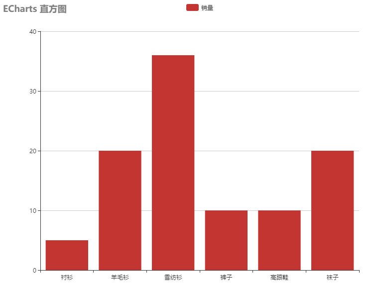
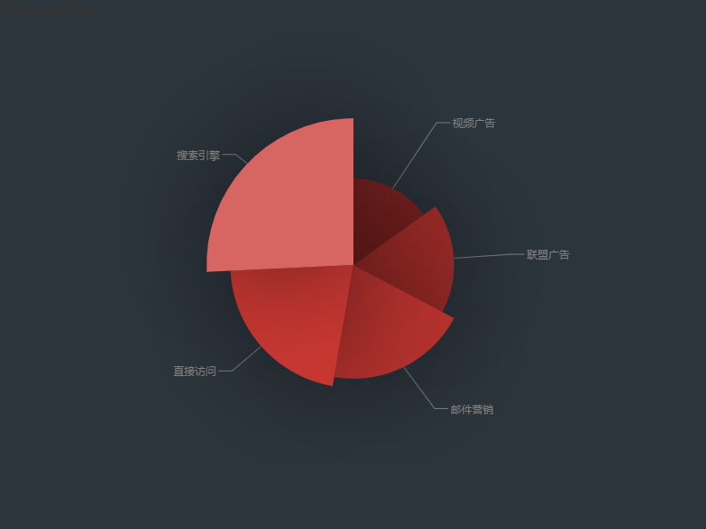
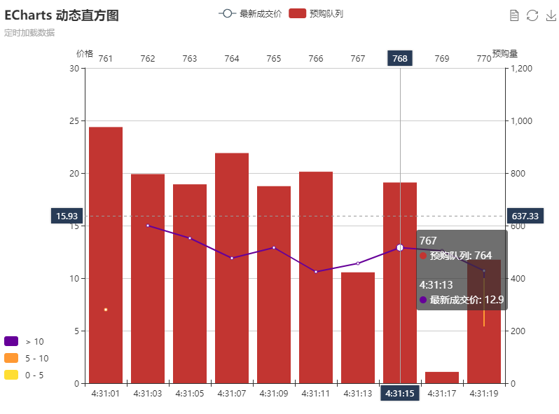
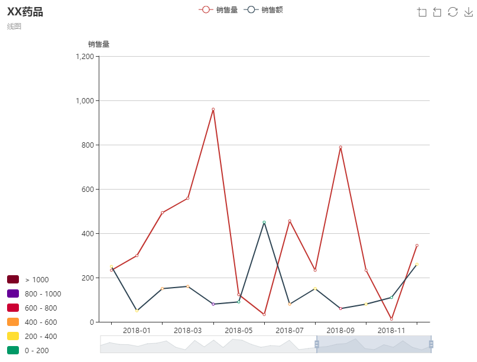

# echart-test-demo

## How to use the view

- install package

```cmd
npm install
```

- Create a HTTP environment([http-server](https://www.npmjs.com/package/http-server))

```node
npm install http-server -g
```

- run server

```node
http-server
```

Open localhost:8080 in browsers

## view

- bar-pragh



- pie-chart



- dynamic-bar-graph



- line-chart

